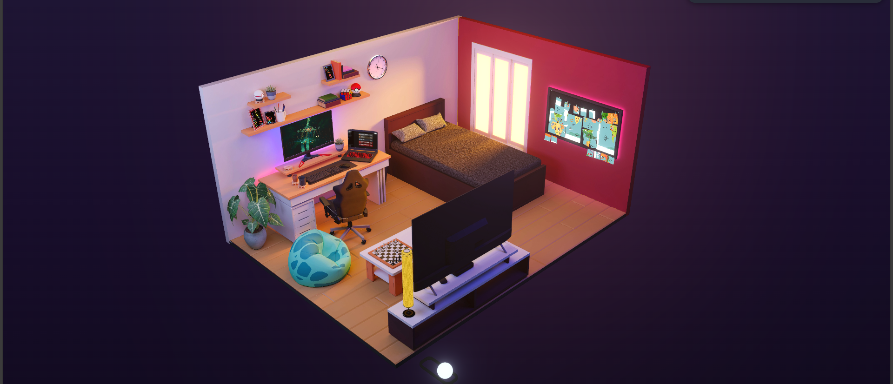

# My Room Portfolio

<p align="center"> 
    
</p>

**Live: [Step Into My Virtual Room](https://vivekroom.vercel.app/)**

Welcome to my immersive 3D universe—a digital sanctuary where creativity meets interactivity! This isn’t just a portfolio; it’s a dynamic playground where every object tells a story. Flip switches, play retro games, explore my projects, and even set the mood with lighting—all within a meticulously crafted virtual space.

## Technologies Used

⚛️ React – The foundation of this interactive experience.<br>
🎨 Three.js & react-three/fiber (r3f) – Bringing 3D magic to life. (r3f docs | Three.js)<br>
✨ react-three/drei (drei) – Handy helpers for 3D wizardry. (Explore drei)<br>
🌈 react-three/postprocessing – Visual effects that dazzle. (See postprocessing)<br>
🎛️ Leva – A sleek control panel to tweak the experience. (Leva docs)<br>
🔄 Zustand – Effortless state management. (Zustand intro)<br>
🎮 react-emulatorjs – Retro gaming, right in your browser. (EmulatorJS)<br>
🎵 Howler.js – Rich audio for an immersive vibe. (Howler docs)<br>
🌀 GSAP – Buttery-smooth animations. (GSAP mastery)<br>
🛠️ Blender – Every 3D model, sculpted by hand. (Blender)<br>


## Inspired By Visionaries

🏠 Bruno Simon’s "My Room in 3D"
🎨 Henry Heffernan’s Portfolio
🍜 Jesse’s Ramen Shop


## Get It Running

Install Node.js
Fire up the terminal:

```
# Install dependencies
npm install

# Run the local server at localhost:5173
npm run dev

# Build for production in the dist/ directory
npm run build
```

Dive in, click around, and uncover hidden surprises. The room is yours to explore—enjoy the journey! 🚀
